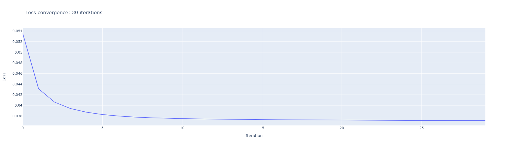

Задание: на датасете MovieLens20M сравнить два подхода к построению рекомендации:

 - коллаборативный: используя только рейтинги. Например SVD-like алгоритмы, ALS, Implicit-ALS.

 - коллаборативный + контентный: используя рейтинги и всю дополнительную информацию о фильмах, имеющуюся в датасете. Например LightFM.

Задачи:

1. Выбрать метрику и обосновать выбор.
2. Придумать и обосновать способ разбиения данных на обучение и валидацию.
3. Обратить внимание на сходимость обучения и настройку важных гиперпараметров моделей.
4. Оценить статистическую значимость результатов.

# 1. Чистка данных
Я посчитал, сколько составляет 10% от всех пользователей и удалил из датасета фильмы с меньшим числом оценок. Размер исходного датасета после фильтрации сократился на 65%. Во-первых, этот шаг позволяет нам снизить разреженность матрицы рейтингов фильмов и пользователей. Во-вторых у меня не хватает мощностей и времени обучать не полном датасете.

# 2. Выбор метрики
Для того чтобы грамотно выбрать метрику необходимо уточнить задачу, которую мы решаем. Пусть мы хотим, чтобы наша рекомендательная система на этапе evaluation выдавала каждому пользователю K рекомендаций фильмов. Переведем пятибалльную рейтинговую шкалу в бинарную, в которой оценки выше или равные 4 будут соответствовать метке 1 – фильм понравился, а остальные оценки метке 0 – фильм не понравился.

В качестве метрики возьмем precision@k, наша задача – максимизировать выдачу релевантных рекомендаций, поэтому абсолютно все предсказания нас не интересуют, фокус на первых k. Метрика precision@k как раз показывает долю релевантных рекомендаций в начале списка.

Матрица рейтингов пользователей и фильмов сильно разреженная. На валидационном / тестовом датасете для каждого пользователя будет небольшое число размеченных данных, но подглядывать в тренировочные данные не хочется – высока вероятность переобучиться, поэтому k следует взять побольше, в данной работе k=25.

# 3. Разбиение данных
Датасет raiting.csv был разбит на тренировочный и валидационный согласно выбранной дате так, чтобы в тренировочный датасет попали все пользовательские действия, которые были совершены до выбранной даты, а в тестовый – оставшиеся. Затем повторим действия для разбиения на тренировочный и валидационный.

# 4.1 Коллаборативный + контентный подход LightFM
Для работы с алгоритмом LightFM были выбраны 2 матрицы:

- матрица пользователей и фильмов, рейтинги в который были заменены на значения: [-1, 0, 1]. Если пользователю не понравился фильм, фильм не был оценен пользователем, и фильм был оценен пользователем на оценку выше 4 баллов соответственно;

- матрица фильмов и тегов, в которой каждому фильму соответствует значение релевантности конкретного тега конкретному фильму.

К сожалению, не хватило времени на анализ гиперпараметров алгоритма. Поэтому запускал с параметрами, взятыми из статьи:
>     latent_size = 10 
>     learning_rate = 0.01
>     item_alpha = 0
>     epochs = 2
Полученная точность: precision@25 = 0.76
# 4.2 Коллабаративный подход: ALS
Модель ALS брал из библиотеки implicit.
В качестве настройки гиперпараметров был использован метод RandomSearch – наилучшие результаты, получились с параметрами:
>     latent_dim = 20 (размер эмбедингов пользователей и фильмов)
>     iterations = 30 (количетсво итераций до сходимости)
>     alpha = 40 (константа alpha из оригинальной статьи, используемая при оценке уверенности)
>     regularization = 0.1 (коэффициент регуляризации)

Если построить график лосса, можно увидеть, что примерно на 27 итерации алгоритм выходит на плато:

Метрику, к сожалению, не получилось посчитать из-за багов в коде. Но если мне будет позволительно, я обязательно исправлю их после дедлайна.

Несмотря на то, что не получилось получить метрику для ALS, с уверенностью можно сказать, что Lightfm будет превосходить его, т.к. обучается на большем количестве информации.

#### Ссылки на использованные статьи:
- [https://github.com/evfro/polara/blob/develop/examples/Comparing%20LightFM%20with%20HybridSVD.ipynb](https://github.com/evfro/polara/blob/develop/examples/Comparing%20LightFM%20with%20HybridSVD.ipynb
)
- [How I would explain building “LightFM Hybrid Recommenders” to a 5-year old!](https://towardsdatascience.com/how-i-would-explain-building-lightfm-hybrid-recommenders-to-a-5-year-old-b6ee18571309)